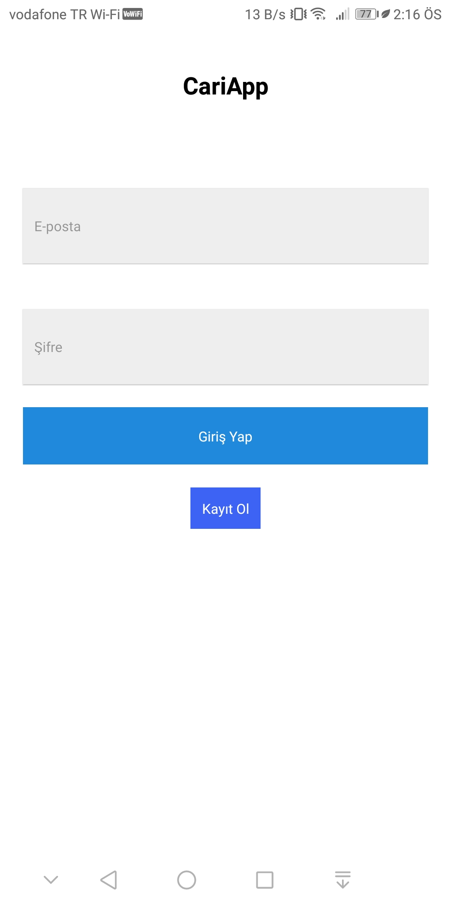

# Cari Mobile

## Screenshoots
## Demo

|
| 
|
|
|
|
|

## Apk instructions

1. Install the apk to the phone
```
    cd files
    adb install app.apk
```

## Development version instructions
1. Clone the repository 
```
    git clone https://github.com/ozgurbayram/carimobile.git
    cd carimobile
```

2. Install dependencies
```
    expo install
```

3. Start the server
```
    expo start
```